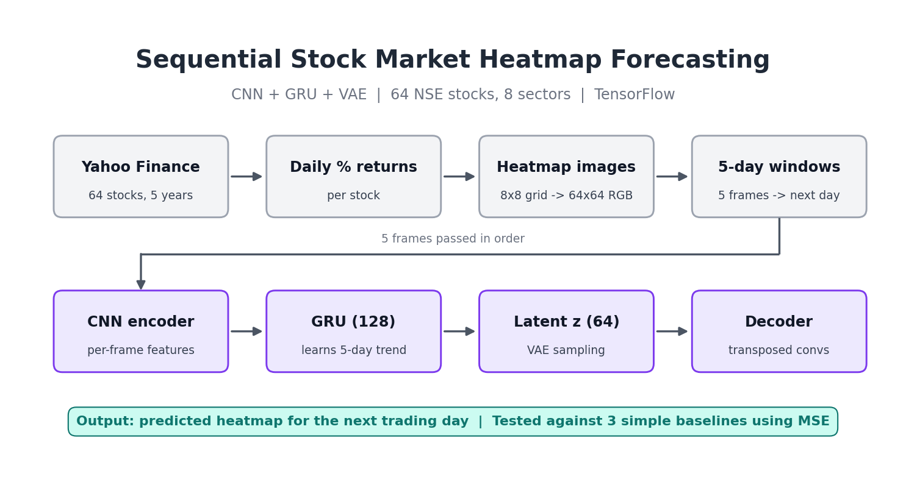
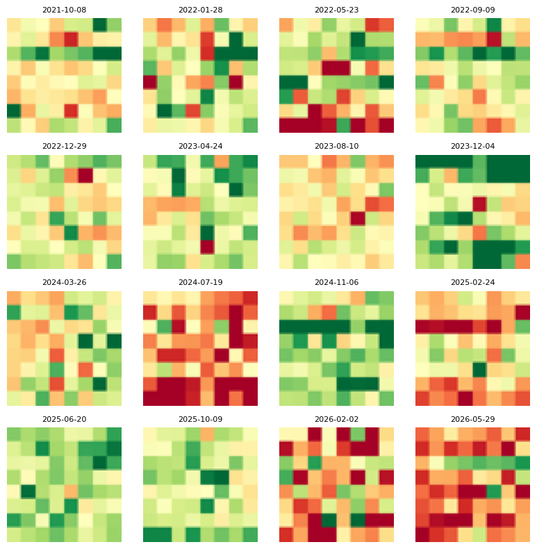
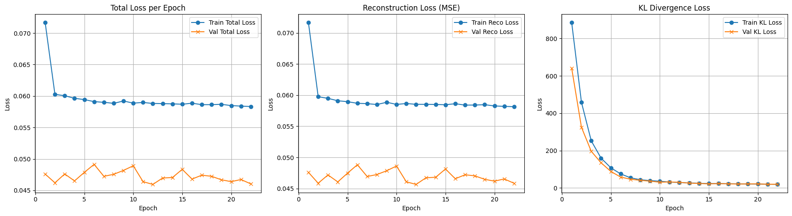

# Sequential Future Heatmap Generation Using a Temporal Deep Learning Model

[](https://colab.research.google.com/github/arjun1228/Sequential_Future_Heatmap_Generation_Using_a_Temporal_DeepLearningModels/blob/main/Heatmap_Generation.ipynb)

A deep learning project that learns to predict the next financial-market heatmap from a sequence of historical heatmaps. The model combines a convolutional neural network (CNN) for spatial feature extraction, a gated recurrent unit (GRU) or long short-term memory (LSTM) network for temporal modeling, and a variational autoencoder (VAE) decoder for probabilistic image generation.

## Project Overview

The project uses daily stock returns from 64 NSE-listed companies organized into eight sectors:

- Banks
- Financials
- Information Technology
- Pharma
- Auto
- FMCG
- Energy
- Metals/Infrastructure

For each trading day, the 64 returns are arranged into an 8 × 8 sector-ordered grid and rendered as a 64 × 64 RGB heatmap. A sequence of five historical heatmaps is used to predict the following day's heatmap.

## How it works

Input is 5 daily 64x64 RGB heatmaps. CNN extracts features from each. GRU learns market movement across 5 days. VAE compresses this into a 64-dimensional latent vector. Decoder generates the next day’s heatmap.

Each 8x8 grid row is a sector (Banks, Financials, IT, Pharma, Auto, FMCG, Energy, Metals/Infra), each cell is a stock, red means loss, and green means gain.

## Pipeline



## Sample Input Heatmaps



## Training Curves



## Model Architecture

The model is composed of the following stages:

1. **TimeDistributed CNN encoder** – extracts spatial patterns from every heatmap in the input sequence.
2. **Temporal layer** – processes the sequence of CNN features using a configurable GRU or LSTM.
3. **Latent representation** – maps the temporal representation to the mean and log-variance of a latent distribution.
4. **Sampling layer** – applies the VAE reparameterization trick to sample a latent vector.
5. **Decoder** – uses dense and transposed-convolution layers to reconstruct the predicted 64 × 64 × 3 heatmap.

The training objective combines:

- Mean squared reconstruction loss
- KL-divergence regularization
- KL warm-up scheduling for more stable training

## Repository Contents

| File | Description |
| --- | --- |
| [`Heatmap_Generation.ipynb`](Heatmap_Generation.ipynb) | Main notebook containing data download, preprocessing, heatmap generation, model construction, training, evaluation, and visualization. |

## Requirements

The notebooks are designed for Google Colab with GPU acceleration. The main dependencies include:

- Python 3
- TensorFlow
- NumPy
- Pandas
- Matplotlib
- Pillow
- yfinance
- requests

The notebook installs or upgrades `yfinance` and `curl_cffi` in its setup cells. A runtime restart may be required after package installation.

## Running the Project

### Option 1: Google Colab

1. Open [`Heatmap_Generation.ipynb`](Heatmap_Generation.ipynb) in Google Colab.
2. Select a GPU runtime, preferably a T4 or equivalent.
3. Run the package-installation cell.
4. Restart the runtime if requested.
5. Run the notebook cells in order.

### Option 2: Local Jupyter Environment

Install the required packages:

```bash
pip install -U tensorflow numpy pandas matplotlib pillow yfinance requests curl_cffi jupyter
```

Then start Jupyter:

```bash
jupyter notebook
```

Open the notebook and execute the cells sequentially.

## Configuration

The main notebook defines project settings in the `CONFIG` dictionary. Important parameters include:

| Parameter | Default | Description |
| --- | ---: | --- |
| `IMAGE_SIZE` | `64` | Width and height of each generated heatmap. |
| `SEQUENCE_LENGTH` | `5` | Number of historical heatmaps used as input. |
| `LATENT_DIM` | `64` | Size of the VAE latent representation. |
| `BATCH_SIZE` | `32` | Training batch size. |
| `EPOCHS` | `50` | Maximum number of training epochs. |
| `LEARNING_RATE` | `1e-3` | Adam optimizer learning rate. |
| `BETA` | `1e-5` | Maximum KL-divergence weight. |
| `CNN_FILTERS` | `[32, 64, 128]` | CNN filter sizes. |
| `GRU_UNITS` | `128` | Number of GRU units. |
| `LSTM_UNITS` | `128` | Number of LSTM units when selected. |
| `TEMPORAL_MODEL` | `GRU` | Temporal model choice: `GRU` or `LSTM`. |
| `TRAIN_FRAC` | `0.70` | Fraction of dates assigned to training. |
| `VAL_FRAC` | `0.15` | Fraction of dates assigned to validation. |
| `TEST_FRAC` | `0.15` | Fraction of dates assigned to testing. |
| `VMIN` / `VMAX` | `-3.0` / `3.0` | Heatmap color scale limits. |

## Data Processing Pipeline

1. Download approximately five years of daily prices for 64 NSE tickers using `yfinance`.
2. Prefer adjusted closing prices when available.
3. Calculate daily percentage returns without forward- or backward-filling missing values.
4. Remove incomplete rows and dates where at least half of the stocks have exactly zero returns.
5. Arrange the returns in the predefined 8 × 8 sector order.
6. Render each grid with the `RdYlGn` color map.
7. Resize each rendered image to 64 × 64 pixels and normalize pixel values to `[0, 1]`.
8. Split dates chronologically into training, validation, and test partitions.
9. Build sliding windows of five input heatmaps and one next-day target heatmap.

## Training

The custom training loop tracks:

- `loss` – total VAE loss
- `reco_loss` – reconstruction loss
- `kl_loss` – KL-divergence loss

Training includes:

- Adam optimization
- KL warm-up during the first ten epochs
- Early stopping based on validation reconstruction loss
- Learning-rate reduction when validation reconstruction loss plateaus

## Results

- Dataset: 1230 trading days (2021-10-08 to 2026-10-07); samples: train 856, validation 179, test 180; chronological split, window size 5
- Model parameters: 4,079,491; trained 22 epochs with early stopping, best epoch 12
- Test MSE (lower is better): Temporal VAE 0.0609; Training-mean baseline 0.0604; Input-average baseline 0.0692; Persistence baseline 0.1139
- Experiments (10 epochs each, test MSE): GRU seq 3 = 0.0605, GRU seq 5 = 0.0603, GRU seq 7 = 0.0611, LSTM seq 5 = 0.0612
- Interpretation: the model reduces MSE by about 47% versus the persistence baseline, but is only comparable to the training-mean baseline, because daily stock returns are very noisy and the model mostly learns the average market pattern.

## What I Learned

- This was the first deep learning project.
- CNNs extract features from images.
- GRUs handle sequences.
- VAE latent space and KL loss.
- Chronological splitting avoids leakage.
- Early stopping.
- Importance of baselines.

## Reproducibility

The notebook sets a global seed of `42` for Python, NumPy, and TensorFlow. Results may still vary slightly across hardware, TensorFlow versions, GPU kernels, and changes in the remotely downloaded market data.

## Important Notes

- Market data is downloaded at runtime and may change as historical data is revised or new trading days become available.
- The project requires network access for `yfinance` data retrieval.
- GPU acceleration is recommended because the CNN-GRU-VAE model processes image sequences and contains several million trainable parameters.
- The notebooks should be run from top to bottom after a runtime restart to ensure that variables, datasets, and model definitions are initialized consistently.
- This project is for educational and research purposes only. It is not financial advice and should not be used as the sole basis for investment decisions.

## License

Licensed under the MIT License.
